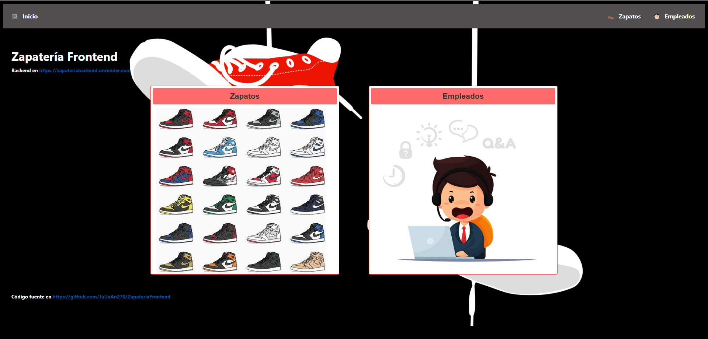

# ZAPATERÍA FRONTEND (con Svelte)

> **Juan Ruiz González**
> 09/03/2023
> Despliegue de Aplicaciones Web 
< 2º D.A.W.
> - *Backend en [zapateriabackend](https://github.com/JuUaAn270/ZapateriaFrontend)**

## Lenguajes Utilizados

- **HTML 5**
- **CSS 3**
- **Javascript (EcmaScript 6)**

